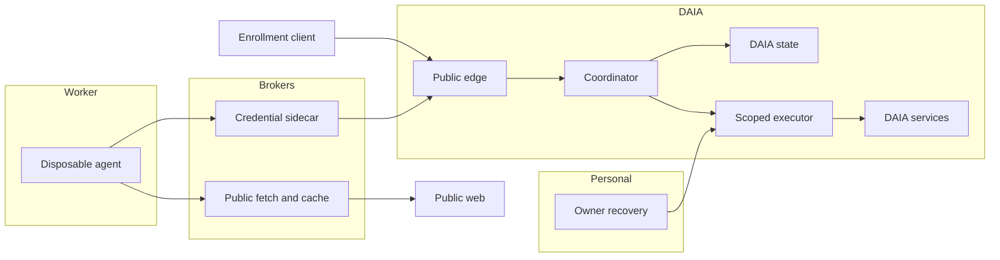

# DAIA public-exposure threat model

## Executive summary

The current private pilot is not ready for open executable jobs. Its narrow verifier
does not execute submissions, but the contributor MCP helper cannot confine the parent
agent or its other tools. For a public service, the highest risks are personal-data
access through participant hosts, credential misuse, and agent-approved changes that
cross into administrative authority. A DAIA-only VPS reduces personal exposure only
if no personal credentials, connectors, context or network routes are brought along.

## Scope and assumptions

Reviewed 11 September 2026 against the current source and the proposed
[public launch](public-launch.md). In scope: MCP/REST ingress, contributor helper,
job evidence, planned worker/executor isolation, installer, GitHub/mail credentials
and CI/release boundaries. Existing protocol threats remain in [threat-model.md](threat-model.md).
This is source/design review; no containment, penetration or production load test was run.

Context confirmed in the design conversation: eventual open enrollment; own VPS and
project accounts; useful web/code/test tools retained; personal environment inaccessible
even when a malicious job passes review. Existing execution grants stay unchanged.
Initially all job inputs are public-source data. Provider internals and attacks on the
owner's unrelated devices are outside this review. Privacy of future customer inputs
requires a separate assessment.

Open implementation questions: VPS isolation support and worker placement; supported
client/authentication combinations; domain/mail recovery setup. These affect the
implementation and estimates, not the requirement to exclude personal access.

## System model

### Primary components

Current: `mcp_server.py` and `http.py` expose coordinator operations; `service.py`
authorizes and assigns; `store.py` persists state; `contributor.py` holds the local
identity and bridges MCP; `verifier.py` checks bounded data. The Astro site is static.
Proposed: authenticated public edge, disposable worker, tool/credential brokers and
scoped executor. None of those proposed isolation layers is established by this report.

### Data flows and trust boundaries

- Visitor → website: public static HTML/assets; no identity, job or coordinator data.
  Only build output is intended for future HTTPS publication.
- Contributor → coordinator: current bearer-authenticated HTTP/MCP on loopback or an
  exact tailnet host; principal-derived root, schemas and 16 KiB body limit. Tailnet
  transport protects the current private link; the app does not provide a public TLS
  edge or ingress time/rate limits (`mcp_server.py::build_mcp_app`, `http.py::BodyLimit`).
- Coordinator → contributor agent: assigned context via MCP; untrusted strings reach
  the host. The helper's instructions do not restrict all host tools (`service.py::request_work`,
  `contributor.py::INSTRUCTIONS`).
- Contributor agent → helper → coordinator: artifacts/leases become validated signed
  envelopes and receipts. The helper currently reads local invite/key files in its own
  account context (`contributor.py::Contributor`, `signer.py::validate_envelope`).
- Proposed worker → tool/credential broker: typed, bounded requests on a channel bound
  to one worker and grant. The sidecar performs all authenticated coordinator operations,
  including registration, status, claims, renewal, release and submission; the worker
  never receives bearer credentials or calls the public edge directly. Network checks
  apply to dependency fetching too; locked, hash-verified artifacts enter a read-only
  cache. Install hooks/builds/tests have no raw network access. Proposed executor → DAIA services:
  exact repository/action grants. Neither path gains authority from task approval.
- Source/patch → build or release: CI/build executes code, so candidate-controlled
  checks are not independent evidence. Publication needs a separately authorized
  artifact, not a secret-bearing runner processing arbitrary changes.

#### Diagram

Target topology; proposed components are not live:

Owner access is inward administration, not a route from jobs to the personal environment.
Coordinator proposals to the executor remain subject to a separate grant.

## Assets and security objectives

| Asset | Why it matters | Objective |
|---|---|---|
| Personal files, accounts, history and network | Must remain outside DAIA access | Confidentiality, integrity |
| Contributor keys and grants | Bound identity, tasks and consent | Confidentiality, integrity |
| Queue, receipts and review history | Determine legitimate work and attribution | Integrity, availability |
| DAIA repository, releases and service credentials | A compromise can spread to participants | Integrity, confidentiality |
| Compute, mailbox and storage budget | Abuse can cause cost and reputation loss | Availability, integrity |
| Owner recovery and policy | Restore service and prevent unauthorized elevation | Confidentiality, integrity |

## Attacker model

### Capabilities

An enrolled participant can submit malicious text within accepted schemas, control
public documents/dependencies, obtain multiple identities, collude in reviews and
flood reachable endpoints. Assume some hostile input persuades a model and passes
agent review. An eventual code job can execute arbitrary code inside its worker.

### Non-capabilities

Enrollment alone does not confer coordinator/admin access or break signatures. No
uploaded code executes in the present verifier. No personal network or secret is
assumed reachable in the target architecture; reaching it requires a missing or broken
boundary. Kernel/provider compromise is possible residual risk, not a demonstrated bug.

## Entry points and attack surfaces

| Surface | How reached | Boundary | Notes | Evidence |
|---|---|---|---|---|
| MCP/REST work and registration | Authenticated client; ingress before authentication | Network/service | Static development bearer; strict schemas, no public admission | `mcp_server.py::build_mcp_app`, `http.py::create_app` |
| Job and review context | Assigned work or fetched source | Untrusted data/model tools | Prompt instructions do not contain the host | `service.py::request_work`, `contributor.py::INSTRUCTIONS` |
| Invite/key files | Local helper and same-account tools | Model/credentials | No separate OS key custody today | `contributor.py::Contributor.__init__`, `docs/desktop-contributor.md` |
| Submission and receipt | Helper tool calls | Agent/coordinator | Signatures, ownership, lease and envelope validation | `signer.py::validate_envelope`, `service.py::submit` |
| Installer/dependency/build/update | Setup or future code task | Supply chain/host | Python setup exists; public bootstrap and updater absent | `contributor.py::configure`, `website/package-lock.json` |
| Administration/release/mail | Future executor integration | Job/control plane | No admin tools exposed in current MCP adapter | `mcp_server.py::build_mcp_app`, `docs/github-workflow.md` |

## Top abuse paths

1. Steal personal information → inject a source excerpt → agent reads a connected
   personal tool or home file → leak through a search query or signed submission.
2. Impersonate a contributor → read helper files using another same-account tool →
   reuse key/token → submit attributable but attacker-controlled results.
3. Expand authority → colluding agents approve a malicious patch or forged check →
   credential-bearing executor applies it as a policy change → seize DAIA control.
4. Exhaust service → many accounts or slow HTTP bodies consume sessions and storage →
   SQLite/work queues stall → useful work stops or costs rise.
5. Compromise an installation → malicious bootstrap/update or dependency runs before
   isolation → read host credentials → spread through repositories or releases.
6. Pivot from DAIA → compromise a worker or service → use a personal tailnet route,
   forwarded SSH socket or recovery mailbox → reach accounts beyond the project.

## Threat model table

| Threat ID | Threat source | Prerequisites | Threat action | Impact | Impacted assets | Existing controls (evidence) | Gaps | Recommended mitigations | Detection ideas | Likelihood | Impact severity | Priority |
|---|---|---|---|---|---|---|---|---|---|---|---|---|
| TM-001 | Malicious job or web source | Host has personal data/tools | Induce a read and encode it in allowed output | Personal disclosure | Personal data | Bounded context; inert verifier (`verifier.py`) | MCP does not contain parent | Dedicated agent environment, no personal inputs/connectors; broker public reads | Synthetic outside-guest canaries; inspect allowed output channels in tests | High if personal host retained | High | high |
| TM-002 | Compromised agent | Same-account access to helper state | Read token/key or abuse signing calls | Identity misuse | Keys, receipts | Envelope checks (`signer.py`) | File custody in helper account | Move custody outside guest; validate exact grant/envelope; revoke | Wrong-target signature tests; denied broker calls | High on broad-access host | High | high |
| TM-003 | Colluding reviewers or poisoned patch | Executor mistakes approval for authority | Change grants, workflows or its own guard | Platform takeover | Policy, releases | No MCP admin tools; manual execution today | Future autonomous executor unbuilt | Old-policy gate outside candidate write scope; immutable action grants; no job-controlled credential runner | Approve hostile policy patch deliberately; assert execution denial | Medium; depends on executor design | High | high |
| TM-004 | Remote client or many identities | Internet exposure | Slow bodies, repeated registration or queue flooding | Outage and cost | Service, storage | Body/artifact/grant caps (`http.py`, `service.py`) | No ingress time/rate limits or global open-enrollment caps | Gateway time/session/rate limits; bounded admission/storage and restore procedure | Load tests; queue/disk thresholds, authenticated audit counts | High when exposed | Medium | high |
| TM-005 | Compromised package/release | Installer or code build runs on host | Execute lifecycle/update payload | Host or downstream compromise | Host, supply chain | No contributed-code execution today | No isolated public bootstrap/update | Reviewed pinned bootstrap before secrets; disposable build; separately authorized release digest | Tampered update; dependency attempting host read/network pivot | Medium | High | high |
| TM-006 | Compromised DAIA runtime | Cross-environment credentials/routes exist | Pivot through VPN, sockets or account recovery | Personal/admin compromise | Personal accounts, recovery | Private pilot limits network exposure today | Current pilot uses owner infrastructure | Fresh DAIA-only VPS; no personal tailnet/forwarding; separate recovery; no root worker | No-route/no-mount tests; recovery-token denial; credential inventory | Medium; configuration dependent | High | high |

## Criticality calibration

Critical means immediate escape into broader account control at launch: demonstrated
personal-host RCE or takeover of an installer-signing identity. No such exploit was
established here. High means a credible boundary failure: personal reads through host
tools, stolen signing keys, or job approval becoming admin permission. Medium includes
bounded single-job resource loss or a recoverable pilot queue outage with enforced
caps. Low includes public website metadata disclosure or rejected malformed requests
with no durable effect. Open enrollment increases likelihood; passing ordinary CI
does not reduce these rankings without a relevant adversarial exercise.

## Focus paths for security review

| Path | Why it matters | Related threats |
|---|---|---|
| `src/daia/contributor.py`, `src/daia/signer.py` | Identity custody, grant recovery, signing, setup | TM-001, TM-002, TM-005 |
| `src/daia/mcp_server.py`, `src/daia/http.py`, `src/daia/cli.py` | Public auth/transport and process entry | TM-004, TM-006 |
| `src/daia/service.py`, `src/daia/store.py`, `src/daia/verifier.py` | Scheduling, durable grants, inert evidence | TM-002, TM-003, TM-004 |
| `.github/workflows/`, `docs/github-workflow.md` | Trusted checks versus candidate execution | TM-003, TM-005 |
| `docs/public-launch.md` | Worker, executor, provider and recovery deployment design | TM-001, TM-003, TM-005, TM-006 |

Release tests must include both hostile and useful tasks: a deliberately approved
malicious job still cannot read a synthetic personal secret, reach a simulated private
network, reset an account or widen its grant; a legitimate worker can research public
sources, install a locked dependency in isolation, produce a patch and run its tests.
Use synthetic targets; never import actual personal data to prove a boundary.

Host protections are additional controls, not evidence that this topology exists.
Codex documents separate controls for local commands and other tools
([permissions](https://learn.chatgpt.com/docs/permissions)); Claude Code documents
limits to its Bash sandbox and credential exposure
([sandboxing](https://code.claude.com/docs/en/sandboxing)). Test the full selected host
configuration and deny an isolation claim when required controls are unavailable.
